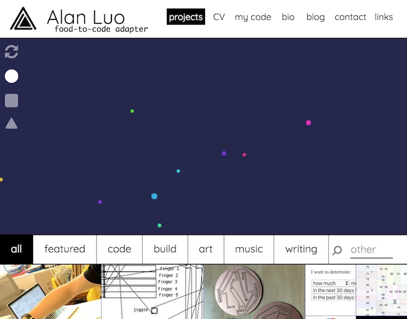
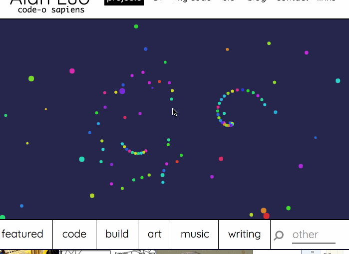
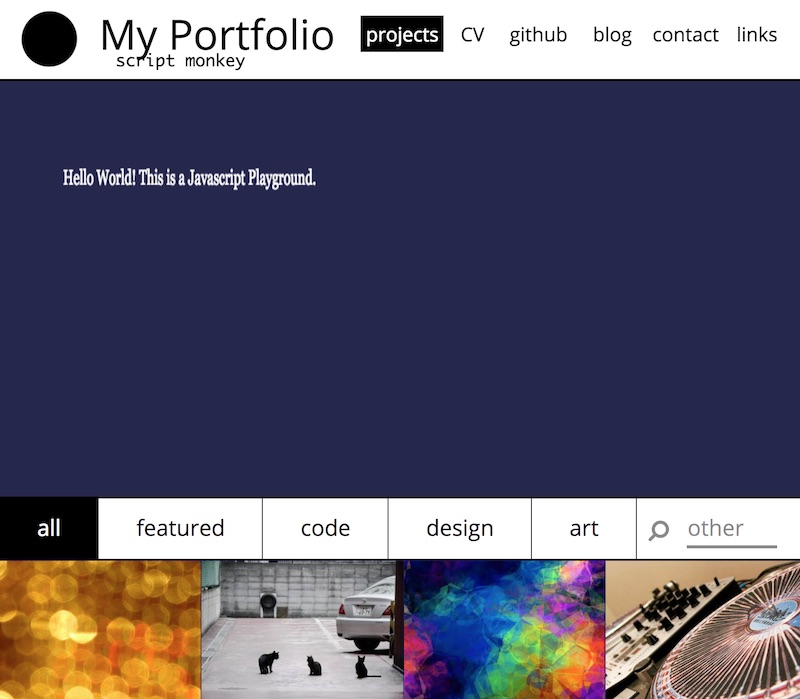
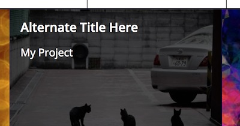
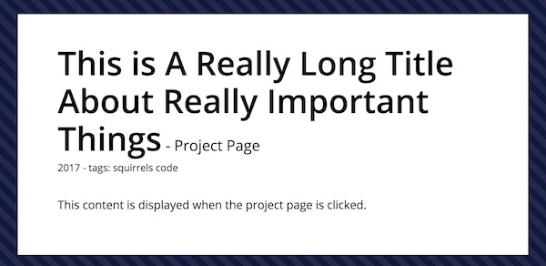

#Attache Theme for Pico

> attache: a flat, usually rigid, rectangular briefcase for carrying business papers, documents, or the like.

This is an up-front and direct portfolio theme with one intention in mind: get other people to see your projects. It's simple and does the job.



There's essentially two prevailing philosophies when it comes to making portfolios. Designers will often have [full-screen, experiential](http://www.danielspatzek.com/Home) portfolios, while developers have essentially [photostreams.](http://lauren-mccarthy.com/)

These two types of themes clearly have very different goals in mind. One is to show off your ability to design. The other is to minimize the distance between viewers and your work.

This theme falls very much in the second category. On the front page, there's a Javascript playground to show off a cool `canvas` demo, followed by a stream of projects which can be clicked on to view in more detail.

This theme only has two types of pages: the homepage and a project page. The homepage collects the project pages, which are each individually accessible.

##Features

**Dynamic Tag System**

In the configuration, you can set primary tags (featured, code, design, and art in the demo) which appear as navigation options beside 'all.' Every project can have any number of tags set to it, and all the non-primary tags automatically get thrown into the search box.


**Sticky Header**


**Javascript Playground**

There's a Javascript playground up front and center for putting all sorts of cool stuff in.



I would put in a global `onresize` handler that forces the canvas to be the right size when the window is moved. This is how I do it using jQuery:

```
cdims = {w:$("#canvas").width(), h:$("#canvas").height()};
$("#canvas").attr('width',cdims.w);
$("#canvas").attr('height',cdims.h);
```

**Typewriter Subtitles**

It's just fun. This can be configured.


**Easily Customizable**

The sample `config.php` file has all the necessary options required for customizing the theme.

**Populated Dummy Site**

There's an entirely populated dummy file with a sample `config.php` to get started so that you can quickly how to use all the features of the site.



##Configuration

Most of the important aspects of the theme are customizable. See the sample `config.php` file for more details.

##Project Pages

This theme only has two types of pages: the homepage and a project page. The homepage collects the project pages, which are each individually accessible.

Here's what a sample project page might look like:

```
---
Title: This is A Really Long Title About Really Important Things
Pointer: Alternate Title Here
Description: My project.
Date: 2017/08/09
Image: img2.jpg
Tags: squirrels code
Robots: noindex,nofollow
Template: project
---

This content is displayed when the project page is clicked.
```

Here's how this gets rendered on the homepage:



And when you click to go to the project page:



Let's break down what each attribute does.

- `Title`: this is the title which is displayed in `<title>` and `<meta>`, as well as on the project page.
- `Pointer`: this is an ***optional*** attribute. If specified, this is what will get rendered on the homepage rather than the full title. use for long titles.
- `Description`: never shown, but used for `<meta>`.
- `Date`: used for organization - the homepage displays projects by most recent first. By default, project pages only display the year, but this is easily changed. (See the [twig](https://twig.symfony.com/doc/2.x/filters/date.html) date spec for more.)
- `Image`: this is the thumbnail that's shown on the front page
- `Tags`: these are used for organization on the front page. Any tags which are not primary tags will automatically get added to the search box on the front page.
- `Robots`: for `<meta>`
- `Template`: specifies that the page should use `project.twig`. Only change if you want to make a certain page special.